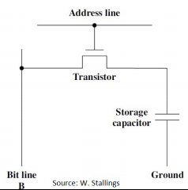
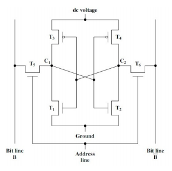
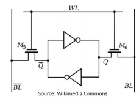
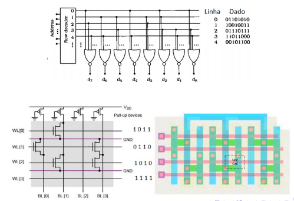
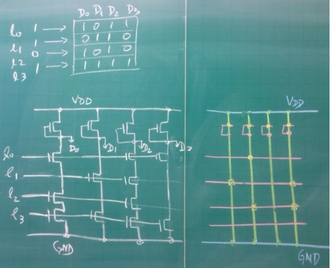
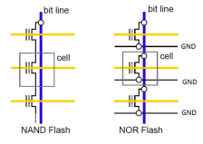

# Aulas 13, 14 e 15 - Memória Interna

### Memória Magnética de Núcleo de Ferrite
* Historicamente: memória interna feito de ferrite (magnetic-core). Por isso *core memory* representa a chamada memória interna
* Representação de zero ou um de acordo com a magnetização do ferrite
* Memória de ferrite é **não-volátil**: não se perde ao ser desligada

### Memória Interna DRAM e SRAM
* Feita de semicondutores
* DRAM e SRAM são ambos voláteis
    * DRAM memória interna
    * SRAM memória cache
* **DRAM - Dynamic RAM:** capacitor armazena ou não carga (representação de zero ou um)
    * Carregado, o capacitor pode perder caga por vazamento, portanto para mantê-lo sempre carregado, aplica-se um pulso de refrescamento (origem do nome dinâmico)
    * Address Line controlar um transistor para permitir acesso ao capacitor. Para escrever um, usa-se voltagem alta no Bit Line e para zero, voltagem baixa.
    * Leitura se dá com o Bit Line usando a carga do capacitor, que o descarrega, fazendo-se necessária restauração
    * 
* **SRAM - Static RAM:** usada em cache, menos densa, mais rápida e mais custosa
    * Mantém o dado inalterado enquanto energizada
    * Célula de 1 bit composta por 4 transistores 
        
        * Address line controla T5 e T6 para escrita ou leitura da memória
        * Para escrita, o valor é aplicado na Bit line para a definição de um dos estados estáveis
        * A leitura se dá através da Bit Line
    * No estado um, C1 é alto e C2 é baixo com T1 e T4 desligados e T2 e T3 ligados
    * No estado zero, C1 é baixo, C2 é alto, com T1 e T4 ligados e T2 e T3 desligados
    * Ambos estados são estáveis enquanto energizado
* Representação alternativa de SRAM: duas portas inversoras (NÃO)

    
    * Dois estados estáveis
        * Q = 0 e !Q = 1
        * Q = 1 e !Q = 0
    * Leitura
        * Linha WL alta liga transistores M5 e M^
        * Q é transmitido para BL e !Q para !BL
    * Escrita
        * Valor armazenado em BL e complemento em !BL
        * Wl alta liga M5 e M6

### Comparação DRAM e SRAM
* Ambas voláteis
* DRAM mais simples e ocupa menos espaço que SRAM
    * DRAM é mais densa (mais células por área), logo, mais barata
* DRAM requer circuitaria para refrescamento, tal custo fixo é compensado para memórias grandes
* Portanto, DRAM é preferida em memórias grandes e SRAM, mais rápida, em memórias cache

### ROM - Read Only Memory
* Memória de conteúdo fixo, portanto, não-volátil
* Usado em processador CISC para armazenar microprograma
* Pode ser fabricado com NOR ou NAND, layout denso
* Erro de um bit acarreta em descartar todo um lote
* **ROM Baseada em NOR**
    * Linha endereçada contém 1 e as demais zero
    * Se tal linha entra no NOR tem saída zero, senão 1
    
* **Projeto de ROM usando NAND**
    * L0: 1011 da forma D0D1D2D3
    * L1: 0110
    * L2: 1010
    * L3: 1111
    

### Tipos de ROM
* **PROM - Programmable ROM**: só pode ser escrita uma vez, por meio elétrico, após a fabricação da pastilha
    * Maior flexibilidade, porém ROM é mais viável em larga escala
* **EPROM - Erasable Programmable ROM:** leitura e escrita como em PROM. Antes de operação de escita, toda a memória é apagada com radiação ultra-violeta, podendo ser repetido para um novo conteúdo
    * Mais custoso
* **EEPROM - Electrically Erasable ROM:** não há necessidade de apagar todo conteúdo para atualizar, apenas bytes selecionados
    * Escrita demorada: cenetenas de micro-segundo por byte
    * Mais custosa e menos densa

### Memória Flash
* Introduzida anos 80
* Memória intermediária entre EPROM e EEPROM, em custo e funcionalidade
* Nome flash faz referência à velocidade com que pode ser alterada: apagada em poucos segundos
* Possibilidade de apagar blocos de memória mas não a nível de bytes
* Tipos NOR e NAND
* Assim como EPROM, usa um transistor por bit, sendo bastante densa
    
    
* **Limite no número de ciclos de escrita**
    * NOR Flash: 10 a 100 mil
    * NAND Flash: 100 a 1000 mil ciclos
    * 2012: Técnica de auto-cura, Macronix relatou uma memória flash que sobrevive a 100 milhões de ciclos de escrita

### Detecção e Correção de Erros na Memória
* Erros de leitura e escrita podem ocorrer por voltagem ou radiação
* Para uma palavra com originalmente **M** bits, **K** bits obtidos em função dos M originais são acrescentados, formando um código de **M + K** bits, que é gravado na memória
* Após ler os M bits, verificamos se os K bits armazenados são iguais aos obtidos através dos M lidos. Se forem iguais, o código foi lido corretamente, senão, foi detectado erro na leitura
* **Exemplo Simples de Detecção de Erro**
    * Acrescenta-se um bit de paridade K = 1, obtido através do XOR da palavra original
    * Ou seja, x5 = x1 &xoplus; x2 &xoplus; x3 &xoplus; x4
    * Para 0011, o bit paridade obtido é 0, portanto resulta em 00110
    * Negrito representa erro de leitura
        * 0**1**110: erro detectado
        * 0011**1**: erro detectado
        * 0**1**11**1**: erro não detectado

### Código de Hamming
* Capaz de determinar qual bit está errado quando há **apenas um** errado
* Evita uma nova leitura da memória ou retransmissão dos dados
* Para M = 7 bits, adicionamos K = 4 bits adicionais, para comportar bits adicionais referentes às potências de dois x1, x2, x4 e x8
    * Os valores desses bits são obtidos por meio de XOR com os valores representados por um na tabela
    * <table style="text-align:center">
        <tr>
          <th>1 a 11 em binário</th>
          <th>8 4 2 1</th>
        </tr>
        <tr>
          <td>1</td>
          <td>0 0 0 1</td>
        </tr>
        <tr>
          <td>2</td>
          <td>0 0 1 0</td>
        </tr>
        <tr>
          <td>3</td>
          <td>0 0 1 1</td>
        </tr>
        <tr>
          <td>4</td>
          <td>0 1 0 0</td>
        </tr>
        <tr>
          <td>5</td>
          <td>0 1 0 1</td>
        </tr>
        <tr>
          <td>6</td>
          <td>0 1 1 0</td>
        </tr>
        <tr>
          <td>7</td>
          <td>0 1 1 1</td>
        </tr>
        <tr>
          <td>8</td>
          <td>1 0 0 0</td>
        </tr>
        <tr>
          <td>9</td>
          <td>1 0 0 1</td>
        </tr>
        <tr>
          <td>10</td>
          <td>1 0 1 0</td>
        </tr>
        <tr>
          <td>11</td>
          <td>1 0 1 1</td>
        </tr>
      </table>
* De acordo com a tabela acima, segue que podemos obter os valores de x1, x2, x4 e x8 com:
    * x1 = x3 &xoplus; x5 &xoplus; x7 &xoplus; x9 &xoplus; x11
    * x2 = x3 &xoplus; x6 &xoplus; x7 &xoplus; x10 &xoplus; x11
    * x4 = x5 &xoplus; x6 &xoplus; x7
    * x8 = x9 &xoplus; x10 &xoplus; x11
* Basta intercalar para obter o código de Hamming correspondente
* Para detectar erros em um código de Hamming já prefeito, usa-se o raciocínio inverso e se calcula os bits de paridade, que no exemplo acima são 4
    * Com k4 = k3 = k2 = k1 = 0 não há erro
    * Em caso contrário o número codificado por k4k3k2k1 determina a posição do bit errado
* **K Bits Adicionais:**
    * M = 4 bits, K = 3 (M = 2^s é 4)
    * De M = 5 até 11, K = 4 (M = 2^s é 4)
    * De M = 12 até 26, K = 5 (M = 2^s é 16)
    * De 27 até 57, K = 6 (M = 2^s é 32)
    * De 58 até 120, K = 7 (M = 2^s é 64)
    * De 121 até 24, K = 8 (M = 2^s é 128)
* Ou seja, com M = 2s, K = s + 1 = log M + 1
* Código de Hamming **não** funciona para erro em mais de um bit

### Erros em mais de 1 bit
* **Pacote de Hamming**
    * Divide-se uma mensagem em pacotes de M bits aos quais se acrescentam os K bits adicionais do código de Hamming
* Divide-se a matriz de dados em pacotes de Hamming (cada pacote representando uma linha), que não devem ser transmitidos sequencialmente (linha por linha) mas sim coluna por coluna, pois ao final da transmissão, basta aplicar o método de Hamming para recuperar eventuais bits perdidos na transmissão de colunas inteiras