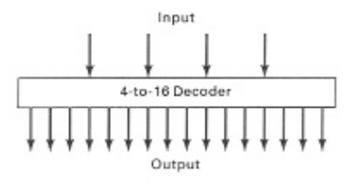

# Aula 22 - Microprogramação
## CISC - Complex Instruction Set Computer

### Índice
1. Conceito de microprogramação
    * Surgimento
    * Exemplos máquinas CISC
2. Máquina MAC
    * Descrição
    * Conjunto de Instruções
3. Arquitetura MIC
    * O que contém o processador
    * Sinais de controle
4. Microprograma
    * Execução de microinstruções
    * Micro-assembler
    * Microinstruções horizontais e verticais

### 01 - Conceito de Microprogramação - Surgimento
* Sir Maurice Wilkes construiu o EDSAC, sucessor do ENIAC
    * Inventou a microprogramação em 1951
    * Professor emérito de Cambridge
    * Turing Award de 1967
* Primeiros computadores possuíam poucas instruções, implementadas em hardware
* Em 1951, **Maurice Wilkes** introduziu a **microprogramação**, permitindo um conjunto grande de instruções de máquina usando um hardware simples capaz de executar as microinstruções

### 01 - Conceito de Microprogramação - Exemplos Máquinas CISC
* Cada instrução de máquina a nível convencional pode dar origem à execução de várias microinstruções, após sua interpretação
* Computadores microprogramados: **CISC** - Complex Instruction Set Computer
    * IBM 360, DEC VAX, Motorola 68030, Intel 8080, Intel 80386, Pentium

### 02 - Máquina MAC - Descrição
* Máquina fictícia no livro de Tanenbaum para ilustrar microprogramação
* **Características**
    * Memória de 4096 palavras de 16 bits (12 bits endereço)
    * Processador com 16 registradores, com:
        * PC (program counter)
        * AC (acumulador)
        * SP (stack pointer)
    * Instrução de máquina a nível convencional com 16 bits

### 02 - Máquina MAC - Exemplos Instruções
* 

### 03 - Arquitetura MIC - Conteúdo Processador
* Arquitetura do processador **MIC** é simples, não implementando as instruções de máquina no nível convencional diretamente
* **Componentes**
    * ALU capaz de 4 operações simples
    * Shifeter para deslocar 1 bit para esquerda ou direita
    * 16 registradores
    * Multiplexador MUX de duas entradas
    * Três decodificadores 4 para 16
    * Registradores MAR e MBR como interface com a memória
    * Clock de 4 fases
* **Datapath - MIC**
    * 

### 03 - Arquitetura MIC - Sinais de Controle
* A cada ciclo, os componentes da arquitetura MIC são controlados por sinais de controle
* **Microinstrução:** conjunto de sinais de controle
* **Sinais de Controle do Registrador**
    * 16 registradores no processador
    * 3 sinais de controle
        * CK=1: valor de bus C colocado dentro do registrador
        * OE1=1: valor do registrador em bus A
        * OE2=1: valor do registrador em bus B
    * 
* **Sinais de Controle do Multiplexador MUX**
    * Um sinal: Control
        * Control=0: saída de MUX seleciona input 0
        * Control=1: saída de MUX seleciona input 1
    * 
* **Sinais de Controle do Decodificador 4 para 16**
    * Não são necessários
    * 
* **Sinais de Controle da ALU**
    * Unidade Lógico Aritmética com 4 operações
    * Controlada por 2 sinais, F<sub>0</sub> e F<sub>1</sub>
        * F<sub>0</sub>F<sub>1</sub> = 00: saída A+B
        * F<sub>0</sub>F<sub>1</sub> = 01: saída (A && B)
        * F<sub>0</sub>F<sub>1</sub> = 10: saída A
        * F<sub>0</sub>F<sub>1</sub> = 11: saída complemento de A
    * Produz também duas saídas booleanas, N e Z
        * N = 1: saída F(A,B) negativa
        * Z = 1: saída F(A,B) zero
    * 
* **Sinais de Controle do Shifter**
    * Deslocador de bits controlado por dois sinais, S<sub>0</sub> e S<sub>1</sub>
        * S<sub>0</sub>S<sub>1</sub> = 00: saída igual entrada
        * S<sub>0</sub>S<sub>1</sub> = 01: desloca entrada em um bit para direita
        * S<sub>0</sub>S<sub>1</sub> = 10: desloca entrada em um bit para esquerda
        * S<sub>0</sub>S<sub>1</sub> = 11: não usada
    * 
* **Clock com 4 fases**
    * Ciclo do clock dividido em 4 subciclos
    * Cada subciclo apresenta valor alto em um quarto do ciclo
    * 
* **Sinais de Controle de MAR e MBR**
    * **MAR - Memory Address Register:** com control = 1, um endereço é colocado em MAR
    * **MBR - Memory Buffer Register:** 3 sinais de controle
        * Control = 1: dado é colocado em MBR
        * RD indica leitura
        * WR indica escrita
    * 
* **Formato de Microinstrução**
    * Microinstrução em MIC: conjunto de sinais de controle para o datapath em um ciclo
    * Formato de 60 bits
        * 16 sinais para carga do barramento A
        * 16 sinais para carga do barramento B
        * 16 sinais para carga de registrador pelo barramento C
        * 2 sinais para controlar "A latch" e "B latch" (L<sub>0</sub> e L<sub>1</sub>)
        * 2 sinais para controlar ALU (F<sub>0</sub> e F<sub>1</sub>)
        * 2 sinais para o shifter (S<sub>0</sub> e S<sub>1</sub>)
        * 4 sinais para MAR e MBR (M<sub>0</sub>, M<sub>1</sub>, M<sub>2</sub>, M<sub>3</sub>, denominados MAR, MBR, RD e WR)
        * 1 sinal para AMUX (A<sub>0</sub>)
        * 1 sinal ENC (enable C) que indica se o resultado deve carregado de volta em algum registrador
* **Formato Microinstrução - Otimizado**
    * 
    * Otimização de usar 4 bits para carga dos barramentos A, B e C (codificando um dos 16 valores)
    * Os 2 bits para "A latch" e "B latch" podem ser substituídos pelo clock
    * **COND** e **ADDR**: controla a próxima microinstrução a ser executada
        * **ADDR:** endereço da próxima microinstrução
        * **COND:** condição para que a microinstrução dada por ADDR seja a próxima

### 04 - Microprograma - Execução de Microinstruções
* **Microprograma:** conjunto de microinstruções
    * Armazenado na memória ROM do processador, **control store**
    ** Registrador MPC (**Micro Program Counter**) aponta para a próxima microinstrução dentro do control store
    * MIR armzena a microinstrução em execução
* **Quatro subciclos na execução de microinstrução**
    * Subciclo 1: carrega a próxima microinstrução no MIR
    * Subciclo 2: coloca valores dos registradores nos barramentos A e B, carregando A latch e B latch
    * Subciclo 3: Tempo para ALU e shifter produzirem seu resultado, a ser carregado no MAR se necessário
    * Subciclo 4: armzena o resultado no registrador ou MBR
* **Dificuldades nas escritas de microinstruções**
    * Cada microinstrução é composta por 32 bits, que determinam o que acontece num ciclo (4 subciclos)
    * Dificuldade por lidar a baixo nível, de zeros e uns

### 04 - Microprograma - Microassembler
* Facilita a escrita de microinstruções por permitir mnemônicos
* Ainda baixo nível, pois cada microinstrução em microassembler deve corresponder a uma microinstrução de 32 bits
* **Exemplo de microinstrução:**
    * `pc := pc + 1`
    * Corresponde a microinstrução de 32 bits
        * A = 0 (Registrador zero é PC)
        * B = 6 (registrador 6 contém 1)
        * C = 0
        * ALU = 0 (0 corresponde à operação soma em ALU)
        * ENC = 1 (resultado de ALU deve voltar ao registrador zero)
    * Mais fácil escrever `pc := pc + 1` do que `00000000000100000110000000000000`
* **Uso das 4 operações da ALU**    
    * Especificar 2 bits que controlam ALU, usa-se **+**, **band** ou **inv**
        * `pc := pc + 1`
        * `ac := band(ac, tir)`
        * `tir := inv(tir)`
* **Uso das operações de deslocamento**
    * Especificar bits SH que controlam o Shifter usa-se **lshift** e **rshift**
        * `ac := rshift(ir)`
        * `tir := lshift(tir+tir)`
            * Colocar tir nos barramentos A e B, realiza adição, desloca o resultado de 1 bit para esquerda, guardando o valor em `tir`
            * Equivale a multiplicar por 4
* **Uso de Desvio Condicional**
    * Desvio incondicional usa `goto`, como `goto 12`
    * Desvios Condicionais podem testar N ou Z (saída da ALU negativa ou zero)
    * **Exemplo**: `ac := ac + 1; if z then goto 45`
        * Pode ser gerado por uma microinstrução de 32 bits, pois cada microinstrução em microassembler deve corresponder a apenas uma microinstrução
* **Desvio Condicional ao valor de um registrador**
    * Exemplo de microinstrução que desvia para 47 se AC for zero
        * Para usar `if z then goto 47`, valor de ac deve aparecer na saída de ALU
            * `alu := ac; if z then goto 47`
            * ac se passa pela ALU para poder utilizar o teste `if z`
<br><br>
* **Leitura da Memória**
    * Leva **dois ciclos**
        * Primeiro ciclo: MAR recebe o endereço a ser lido e o bit RD ligado
            * `mar := sp; rd`
        * Segundo ciclo: bit RD continua ligado
            * `rd`
    * O dado lido fica disponível em MBR no terceiro ciclo
    * No ciclo 2 há um desperdício, pois uma microinstrução tem 32 bits e apenas um bit RD está sendo usado, portanto, um bom microprogramador tentaria aproveitar melhor tal microinstrução, incluindo algo que pode ser feito no mesmo ciclo
        * `mar := sp; rd`
        * `ac := ac + 1; rd`
* **Escrita na Memória**
    * Leva **dois ciclos**
        * Primeiro ciclo: MBR deve conter o dado a ser escrito, MAR conter o endereço em que o dado será escrito e o bit WR ligado
            * `mar := sp; mbr := ac; wr`
        * Segundo ciclo: bit WR continuar ligado
            * `wr`
    * Novamente há um desperdício no segundo ciclo e mais coisas podem ali serem incluídas
        * `mar := sp; mbr := ac; wr`
        * `ac := ac + 1; if z goto 40; wr`
<br><br>
* **Microprograma Eficiente**
    * Microinstrução tem 32 bits que comandam o processador durante um ciclo
    * Importante utilizar todos os bits disponíveis na mesma microinstrução para aproveitar o mesmo ciclo de processador
    * Leitura leva dois ciclos, portanto **rd** deve aparecer em duas microinstruções seguidas, que devem ser aproveitdas e não definidas apenas como rd (ou como wr para escrita)
* **Exemplo de microprograma eficiente**
    * Criação de uma nova instrução de máquina a nível convencional chamada NOVA:
        * Escrever o valor zero na memória endereçada por SP
        * Faz AC ficar igual a 4 vezes valor de SP
        * Somar TIR em AC e se o valor de tal soma ficar negativa, faz AC igual a zero, senão AC igual a um
        * No final, controle retorna à posição zero
    * Supor NOVA já lida e no IR, já feita a decodificação, sabendo do que se trata a instrução NOVA
* **Solução Ineficiente**
    ```
    101: mar := sp;
    102: mbr := 0; wr
    103: wr
    104: ac := (sp+sp)
    105: ac := ac + ac
    106: ac := ac+tir; if n goto 109
    107: ac := 1
    108: goto 0
    109: ac := 0
    110: goto 0
    ```
* **Solução Eficiente**
    ```
    101: mar := sp; mbr := 0; wr
    102: ac := lshift(sp+sp); wr
    103: ac := ac+tir; if n goto 105
    104: ac := 1; goto 0
    105: ac := 0; goto 0
    ```

### 04 - Microprograma - Microinstruções Horizontais e Verticais
* Microinstrução especifica sinais de controle necessários ao controle da microarquitetura
    * **Microinstrução Horizontal:**
        * Sinais necessários colocados na mesma microinstrução, sem codificação
        * "Control Store" contém pequeno número de microinstruções compridas formadas com muitos campos, por isso o nome **horizontal**
    * **Microinstrução Vertical:**
        * Poucos campos, altamente codificados
        * Mais de uma microinstrução pode se fazer necessária para especificar todos sinais
        * "Control Store" contém grande número de microinstruções curtas, portanto o nome **vertical**